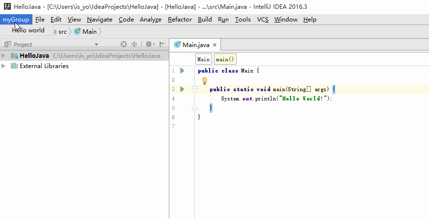
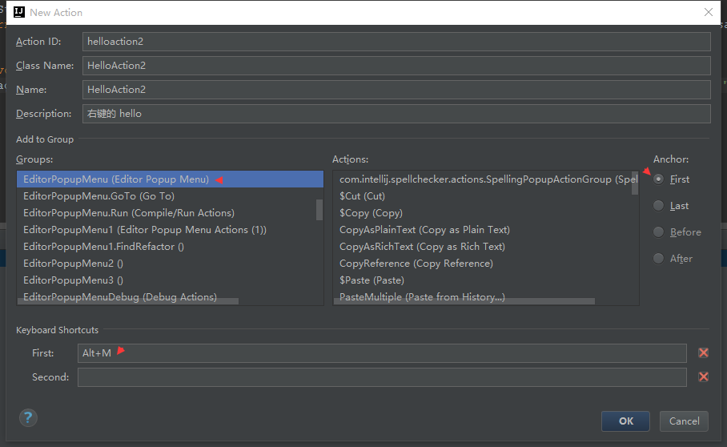
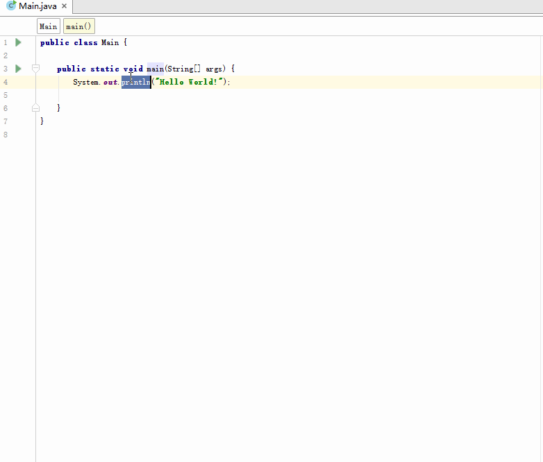
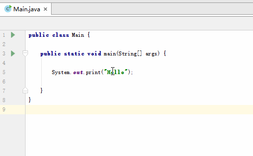
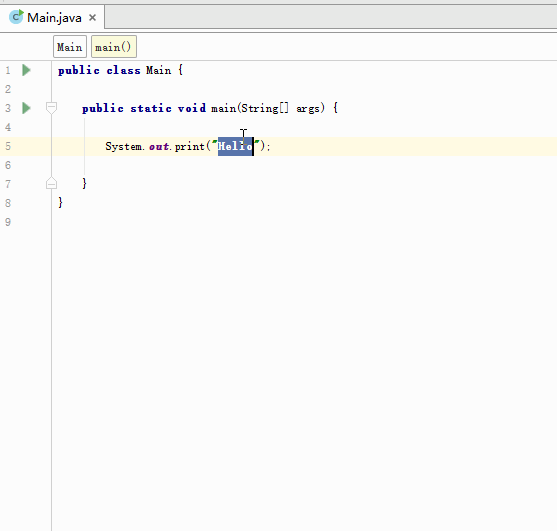

# IdeaPluginsAssistName
一个idea插件,帮助命名的插件

### 使用说明
工程尚未完成...

正在逐步更新...

### 开发的流程
一步一步写下开发流程,记录学习...

##### 开始创建
 - 1.安装 Intellij IDEA 开发工具
 - 2.打开 Intellij IDEA , 创建新的工程 'Create New Project'
 - 3.在左侧的选择栏 里 选择 'Intellij Platform Plus' 
    *(右边默认就好,不用选择;
          同时也注意下右边上部分的 Project SDK ,如果是空的话,点击它旁边的 New ,路径选择 Intellij IDEA 的安装目录,就可以了)*,点击 'Next'
 - 4.填好工程名称 和 目录 点击 'Finish'
 
 *此部分参考了此篇文章: http://www.jianshu.com/p/3ba18f88ba06* 
 
##### 开始尝试Demo
 - 先写个 hello 的 demo 吧
 - 参考了此网站内的文章: http://www.tuicool.com/articles/yeuyIj
 - 做出了个简单的Demo效果:
    
    
##### 思考
 - 虽然做出了一个插件,但是效果跟项目的需求不一致
     - 不想做菜单上的插件,想用个快捷方式,以及右键菜单的形式出现自己的插件
     - 需要根据选中的文本,进行操作
 
#### 进一步的改进
 - 将插件改成右键和快捷键使用的方式
 - 有跟文本交互的实现
 - 参考了此网站内的文章:http://blog.csdn.net/huachao1001/article/details/53885981
 - 新建了个Action (HelloAction2),做了如下配置:
    
  
  ,做出了个相应的Demo:
    
    
#### 在进一步改善
 - 想进一步右键选中后,弹出一个选择的列表,列出推荐命名的一些方案
 
 - 解决方案:
    找到一个 LookupManager 的类 ,用于显示出一个列表,并且实现了自动替换字的效果,做出的效果如下:
    
    
 - <strong>重点推荐项目:</strong>https://github.com/YiiGuxing/TranslationPlugin
 [在这个项目里学到了很多,比如 LookupManager 怎么搜索都没找到什么资料,还是看到这个项目有写才知道的这个,然后自己试着写]
 
#### 完成上面的想法
   于是根据查找完成一个了列表对话框 ,然后具有翻译功能.然后再先显示大概的效果.再进行下一步:
   
  
   

    